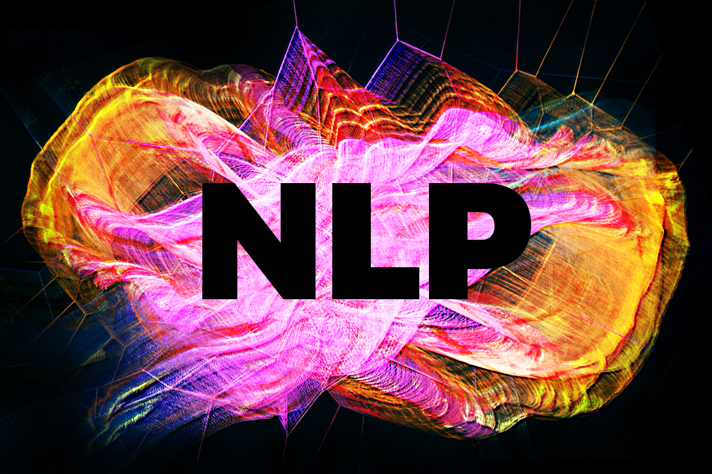
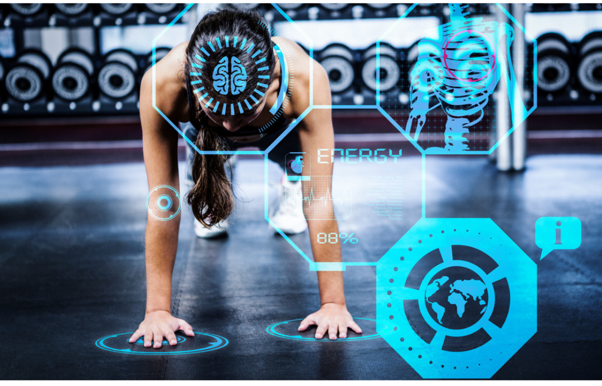

<html lang="en">
<head>
    <meta charset="UTF-8">
    <meta name="viewport" content="width=device-width, initial-scale=1.0">
    <title>Green Shooting Stars</title>
    
</head>
<body>
    

        

        

        

        

        

        

        

        

        

        

        

        

    

</body>
</html>

# Portfolio

<html>
<head>

</head>
<body>

<h1 class="text">ELI DANIELS: DATA SCIENTIST</h1>

</body>
</html>

Data-driven entrepreneur and versatile data scientist with a proven track record of leveraging diverse skill sets to seize opportunities. Proficient in data modeling and processing, as well as programming languages including Python and SwiftUI. Procuring, cleaning and interpreting data from varying sources to create solutions and overcome challenges.
                  
## Skills:
Python - SQL - Pandas - NLP - Keras - Tensor Flow - Data Visualization - Data Cleaning - Predictive Modeling - Database Structures - Agile Methodologies - Statistical Analysis - User Experience 

## Software: 
Jupyter Notebook - Visual Studio Code - Tableau - Power BI - Google Analytics - MongoDB - MySQL - Google Suite 

### CERTIFICATIONS 
General Assembly: Data Science Immersive
- - - - 
IBM Data Science Professional: Python for Data Science, AI & Development
- - - -
Databases and SQL for Data Science with Python 
- - - -
UX Design Process: Empathize, Define, and Ideate 

## [Emotion Recognition using Deep Learning](https://github.com/elidaniels99/Emotion_Recognition){:target="_blank" style="color: white;"}

  

    
  

  

    

      Developed and implemented a deep learning-based emotion recognition model for facial images. Conducted data preprocessing, feature extraction, and model training using Python, TensorFlow, and Keras. Created an interactive web application using Streamlit to provide a user-friendly interface.
    

    
<strong>Streamlit App:</strong>

    <ul>
      <li><strong>Image Emotion Recognition:</strong> Upload an image to detect and display emotions expressed in human faces. The app uses deep learning to recognize emotions like happiness, sadness, surprise, anger, disgust, neutral.</li>
      <li><strong>Live Webcam Emotion Detection:</strong> Experience real-time emotion detection through your webcam. Toggle the webcam feed, and see your own emotions overlaid on the live video.</li>
    </ul>
  

## [Web APIs & NLP](https://github.com/elidaniels99/Web-APIs-NLP){:target="_blank" style="color: white;"}

  

    
  

  

    

      Scraped and parsed data from subreddits enabling the collection of subscriber counts, posts, and relevant metrics for comprehensive comparative analysis. Employed advanced Natural Language Processing (NLP) techniques, including tokenization, lemmatization, and stopwords removal, to perform in-depth text analysis. This process facilitated sentiment analysis, keyword extraction, and content type classification, shedding light on user engagement and content preferences in these communities.
    

  

## [Fitness Activity Recommender](https://github.com/elidaniels99/FitnessActivityRecommender){:target="_blank" style="color: white;"}

  

    
  

  

    

      Assist individuals in achieving their fitness goals by analyzing fitness activity through data from two distinct tracking devices, being Apple Watch vs Fitbit. Leveraging data from these devices, including health-related attributes, we will calculate BMI, combine user-specific insights, and employ a predictive activity type model to create recommended fitness activities personalized to the individual to help them attain a BMI within the "normal" range.
    

  

- K-Means Clustering Model to determine how the model would classify our known classifications of underweight, normal weight, overweight, and obese for optimized value of K.
- DBSCAN Model to compare the difference between the optimized value of K while comparing silhouette scores.
- Random Forests Model to predict activity type for users based on their fitness and health data.

